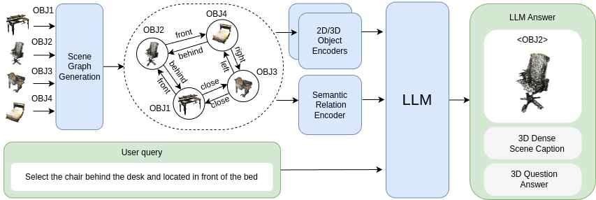

# 3DGraphLLM

[](https://arxiv.org/abs/2412.18450)
[](https://huggingface.co/wingrune/3DGraphLLM)

In this work, we propose 3DGraphLLM, a method for constructing a learnable representation of a 3D scene graph, which serves as input for LLMs to perform 3D vision-language tasks.

<p align="center">

</p>

## News

[2024.12] We release 3DGraphLLM pre-training on GT instance segmentation scene graphs

[2024.12] We release 3DGraphLLM [paper](https://arxiv.org/abs/2412.18450) [code](https://github.com/CognitiveAISystems/3DGraphLLM)

### 🔥 Semantic relations boost LLM performance on 3D Referred Object Grounding and Dense Scene Captioning tasks


  |      	| [ScanRefer](https://github.com/daveredrum/ScanRefer) 	|         	| [Multi3dRefer](https://github.com/3dlg-hcvc/M3DRef-CLIP)	|        	|  [Scan2Cap](https://github.com/daveredrum/Scan2Cap) 	|            	| [ScanQA](https://github.com/ATR-DBI/ScanQA)  	|        	| [SQA3D](https://github.com/SilongYong/SQA3D) 	|
  |:----:	|:---------:	|:-------:	|:------:	|:------:	|:---------:	|:----------:	|:------------:	|:------:	|:-----:	|
  |      	|  Acc@0.25 	| Acc@0.5 	|    F1@0.25   	| F1@0.5 	|  CIDEr@0.5 	| B-4@0.5 	| CIDEr 	| B-4 	|    EM  	|
  | [Chat-Scene](https://github.com/ZzZZCHS/Chat-Scene/tree/dev) 	|    55.5   	|   50.2  	|  57.1 	|  52.3  	|    77.1  	|    36.3    	|     **87.7**      	|    **14.3**  	|   <ins>54.6</ins>   	|
  | <ins>3DGraphLLM Vicuna-1.5 </ins> 	|   <ins>57.0</ins>    	|  <ins>51.3</ins>  	|  <ins>60.1</ins>  	|  <ins>55.4</ins>  	|   <ins>81.2</ins>    	|    <ins>36.3</ins>    	|    <ins>87.6</ins>     	|  12.1 	| 53.1  	|
   **3DGraphLLM LLAMA3-8B**	|   **60.2**    	|  **54.6**   	|  **63.0**  	|  **58.2**  	|   **82.9**    	|    **37.8**    	|     83.1     	|  <ins>12.5</ins>   	| **55.2**  	|


## 🔨 Preparation

- Prepare the environment:
  
  ```shell
  conda create -n 3dgraphllm python=3.9.17
  conda activate 3dgraphllm
  conda install pytorch==2.2.1 torchvision==0.17.1 torchaudio==2.2.1 pytorch-cuda=11.8 -c pytorch -c nvidia
  pip install -r requirements.txt
  ```
- If you don't have root permissions to install java (needed for pycocoeval scripts for metrics such as BLEU and CIDER), install it with conda:

```
conda install -c conda-forge openjdk
```

  
- Download LLM backbone:
  -  We use LLAMA3-8B-Instruct in our experiments, which can be downloaded from [Hugging Face](https://huggingface.co/meta-llama/Meta-Llama-3-8B-Instruct).

  - Change the `llama_model_path` in [config.py](./scripts/config.py) to the path of `LLAMA3-8B-Instruct`.
  

- Annotations and extracted features:
  
  Please follow the instructions in [preprocess](preprocess/).


## 🤖 Training and Inference

- Pre-training on GT instance segmentation scene graphs.
  - Modify [run_gt_pretrain.sh](scripts/run_gt_pretrain.sh):
    ```python
    train_tag="scanrefer#scan2cap#scanqa#sqa3d#multi3dref#nr3d_caption#obj_align"
    val_tag="scanrefer#scan2cap#scanqa#sqa3d#multi3dref"
    evaluate=False
    ```

    <details>
    <summary> Explanation of "train_tag" and "val_tag" </summary>

    - Use `#` to seperate different datasets

    - Datasets:
      - `scanrefer`: [ScanRefer](https://github.com/daveredrum/ScanRefer) Dataset
      - `scan2cap`: [Scan2Cap](https://github.com/daveredrum/Scan2Cap) Dataset
      - `scanqa`: [ScanQA](https://github.com/ATR-DBI/ScanQA) Dataset
      - `sqa3d`: [SQA3D](https://github.com/SilongYong/SQA3D) Dataset
      - `multi3dref`: [Multi3dRefer](https://github.com/3dlg-hcvc/M3DRef-CLIP) Dataset
      - `nr3d_caption`: A captioning dataset originated from [Nr3D](https://github.com/referit3d/referit3d).
      - `obj_align`: A dataset originated from ScanRefer to align the object identifiers with object tokens.

    </details>
  - Run: `bash scripts/run_gt_pretrain.sh`

- Training
  - Modify [run.sh](scripts/run.sh):
    ```python
    train_tag="scanrefer#scan2cap#scanqa#sqa3d#multi3dref#nr3d_caption#obj_align"
    val_tag="scanrefer#scan2cap#scanqa#sqa3d#multi3dref"
    evaluate=False
    pretrained_path="outputs/llama3-8b-gt-pretrain-2/ckpt_00_28927.pth"
    ```
  - Run: `bash scripts/run.sh`


- Inference
  
  - Modify [run.sh](scripts/run.sh):
  
    ```python
    val_tag="scanrefer#scan2cap#scanqa#sqa3d#multi3dref"
    evaluate=True
    pretrained_path="/path/to/pretrained_model.pth"
    ```
  
  - Run: `bash scripts/run.sh`
  
## 🚀 Demo

- Run: `bash demo/run_demo.sh`. You will be prompted to ask different queries about Scene 435 of ScanNet.


## 📪 Contact

If you have any questions about the project, please open an issue in this repository or send an email to [Tatiana Zemskova](zemskova@airi.net).

## 📑 Citation

If you find this work helpful, please consider citing our work as:

```
@misc{zemskova20243dgraphllm,
      title={3DGraphLLM: Combining Semantic Graphs and Large Language Models for 3D Scene Understanding}, 
      author={Tatiana Zemskova and Dmitry Yudin},
      year={2024},
      eprint={2412.18450},
      archivePrefix={arXiv},
      primaryClass={cs.CV},
      url={https://arxiv.org/abs/2412.18450}, 
}
```


## 😊 Acknowledgement

Thanks to the open source of the following projects:

[Chat-Scene](https://github.com/ZzZZCHS/Chat-Scene/tree/dev)
